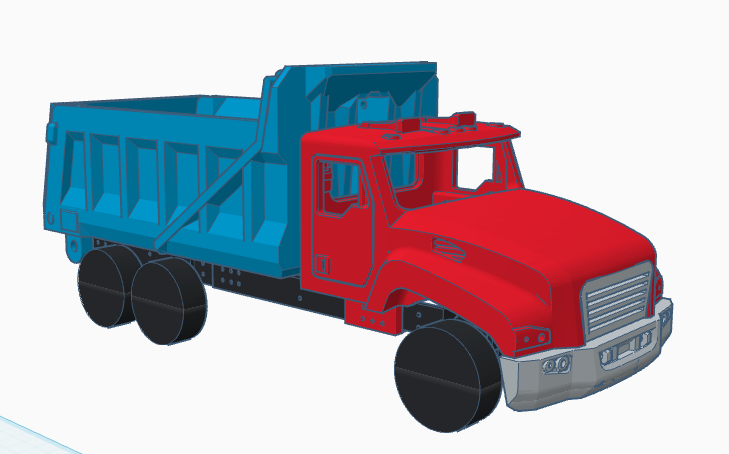
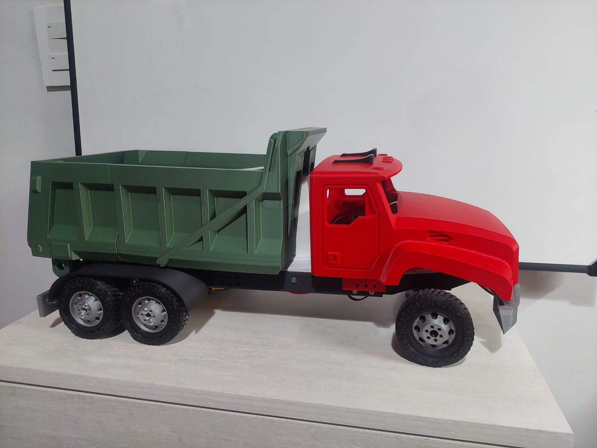
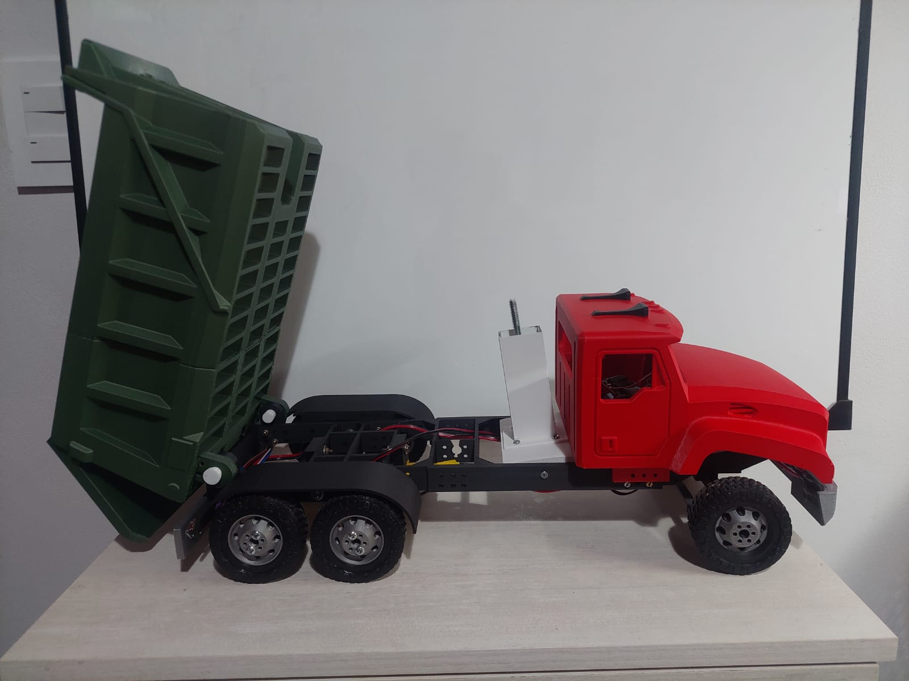
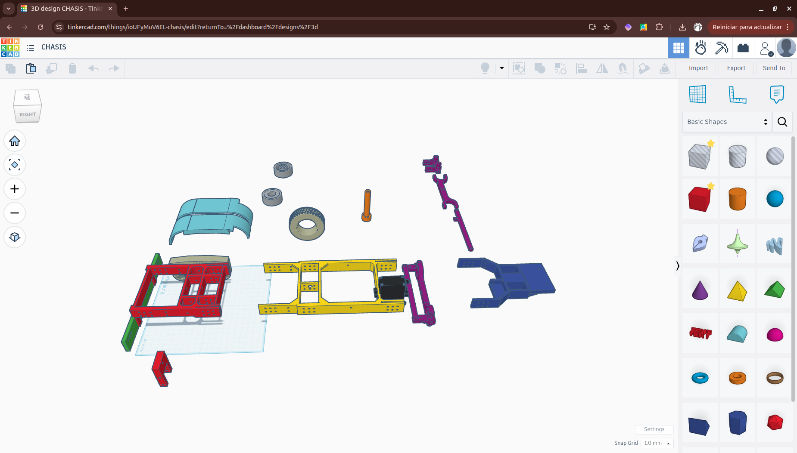
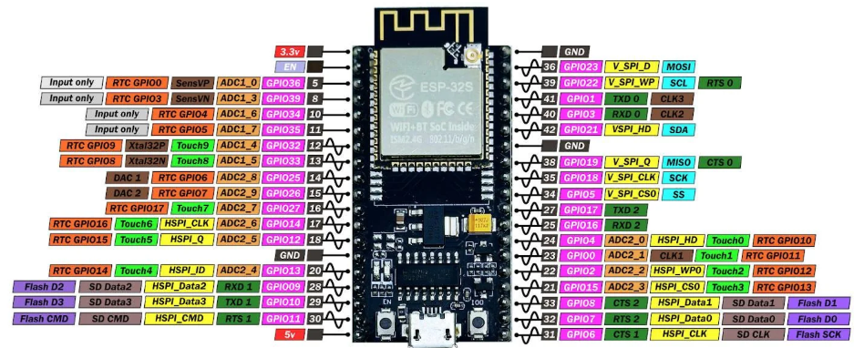
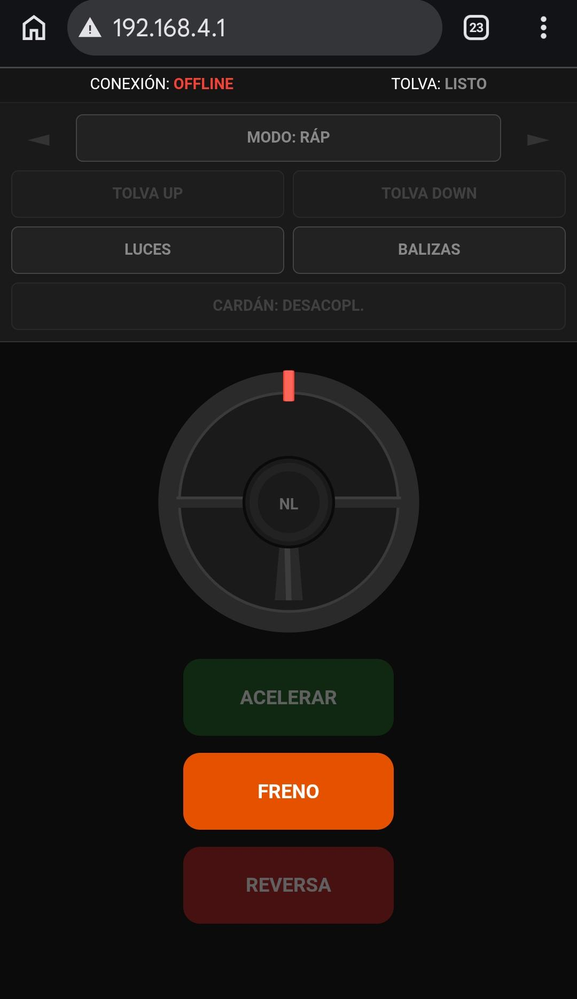

# 🚛 RC Truck NeutronLab — ESP32 Control System




Sistema de control inalámbrico para camión RC con tolva volcadora basado en ESP32, con interfaz web embebida accesible desde cualquier celular sin necesidad de aplicación.

El proyecto reemplaza los radiocontroles tradicionales por un control vía WiFi (modo Access Point) servido directamente desde el ESP32, replicando el comportamiento de un camión real: cardán/toma de fuerza, bloqueos cruzados de seguridad, luces de freno con timer, balizas, indicadores de giro automáticos y failsafe por pérdida de conexión.



---

## 📑 Tabla de contenidos

- [Características principales](#-características-principales)
- [Hardware utilizado](#-hardware-utilizado)
- [Archivos 3D para imprimir](#-archivos-3d-para-imprimir)
- [Guía de armado](#-guía-de-armado)
- [Diagrama de conexiones](#-diagrama-de-conexiones)
- [Tabla de pines del ESP32](#-tabla-de-pines-del-esp32)
- [Control WiFi](#-control-wifi)
- [Funciones del camión](#-funciones-del-camión)
- [Sistema de seguridad y failsafe](#-sistema-de-seguridad-y-failsafe)
- [Instalación](#-instalación)
- [Créditos](#-créditos)

---

## ✨ Características principales

- 🌐 **Control vía WiFi sin internet** — el ESP32 crea su propio Access Point, no requiere router externo.
- 📱 **Interfaz web embebida** — funciona en cualquier celular con navegador, sin instalar apps.
- 🎮 **Volante táctil SVG** — control de dirección con gestos de rotación realistas.
- 🚚 **Tolva con motor paso a paso** — controlada directamente desde el ESP32 con AccelStepper.
- 🔒 **Cardán virtual** — simula la toma de fuerza de un camión real con bloqueos cruzados.
- 💡 **Sistema de luces realista** — bajas, freno con timer, reversa, giros automáticos y balizas.
- 🛡️ **Failsafe automático** — corta motores ante pérdida de conexión.
- 🟢 **Indicador ONLINE/OFFLINE** en tiempo real.

---

## 🔧 Hardware utilizado

| Componente | Modelo / Especificación |
|---|---|
| Microcontrolador | ESP32 DevKit V1 (30 pines) |
| Driver paso a paso | A4988 (con disipador) |
| Motor de tolva | NEMA17 |
| Motor de tracción | DC con driver PWM (puente H) |
| Servo de dirección | SG90 / MG90S (50 Hz, 500-2400 µs) |
| Alimentación motor | 12V (batería o fuente) |
| Alimentación lógica | 5V (del ESP32 o externa) |
| LEDs | Luces bajas, freno, reversa, giros izq/der |

---

## 🖨️ Archivos 3D para imprimir

Todos los archivos `.stl` del chasis, carrocería, tolva y soportes están disponibles en la carpeta [`stl/`](stl/) del repositorio.

### Configuración de impresión utilizada

| Parámetro | Valor |
|-----------|-------|
| Impresora | Bambu Lab A1 |
| Diámetro de boquilla | 0.4 mm |
| Altura de capa | 0.2 mm (estándar) |
| Paredes / perímetros | 3 a 4 |
| Relleno (infill) | 20% |
| Material recomendado | PLA o PETG |

> 💡 **Tip:** Las piezas estructurales (chasis, soportes de motor, ejes) pueden imprimirse con 4 paredes para mayor resistencia. Las piezas estéticas (carrocería, detalles) con 3 paredes son suficientes.

---

## 📘 Guía de armado

El paso a paso completo para la construcción mecánica y eléctrica del truck está disponible en el archivo [`guia_armado.md`](guia_armado.md).

Allí se detalla el orden de ensamblaje recomendado, conexiones eléctricas paso a paso, calibración del Vref del driver, y consejos prácticos para evitar errores comunes durante el armado.



---

## 🔌 Diagrama de conexiones

```
                        ┌─────────────────┐
                        │   CELULAR       │
                        │   (Navegador)   │
                        └────────┬────────┘
                                 │ WiFi 2.4 GHz
                                 │ (AP del ESP32)
                                 │
                        ┌────────▼────────┐
                        │     ESP32       │
                        │   (Servidor     │
                        │     web AP)     │
                        └────────┬────────┘
                                 │
        ┌────────────┬───────────┼───────────┬──────────────┐
        │            │           │           │              │
   ┌────▼────┐  ┌────▼────┐ ┌────▼────┐ ┌────▼────┐  ┌──────▼──────┐
   │  Servo  │  │ Driver  │ │ Driver  │ │  LEDs   │  │   Driver    │
   │ Dirección│ │ Motor DC│ │  A4988  │ │ (luces) │  │   A4988     │
   │         │  │ (PWM)   │ │ NEMA17  │ │         │  │             │
   └─────────┘  └─────────┘ └─────────┘ └─────────┘  └─────────────┘
```

---

## 📌 Tabla de pines del ESP32

| GPIO | Función | Descripción |
|------|---------|-------------|
| **2** | Servo dirección | PWM 50 Hz al servo (rango 500-2400 µs) |
| **4** | DIR (A4988) | Dirección del motor paso a paso de tolva |
| **12** | Motor A | PWM hacia adelante (motor de tracción) |
| **13** | Motor B | PWM hacia atrás / reversa |
| **14** | Luces bajas | Salida digital LED bajas |
| **25** | Giro izquierdo | Salida digital LED giro izq |
| **26** | Luz reversa | Salida digital LED reversa |
| **27** | Luz freno | Salida digital LED freno (timer 1500 ms) |
| **32** | STEP (A4988) | Pulsos al motor paso a paso de tolva |
| **33** | Giro derecho | Salida digital LED giro der |

### Conexión del driver A4988

| Pin A4988 | Conectar a | Observación |
|-----------|-----------|-------------|
| VMOT | +12V | Alimentación del motor |
| GND (motor) | GND batería 12V | |
| VDD | +5V | Alimentación de lógica del driver |
| GND (lógica) | GND del ESP32 | **Crítico:** debe compartir GND con ESP32 |
| STEP | GPIO 32 | Pulsos de paso |
| DIR | GPIO 4 | Sentido de giro |
| ENABLE | GND | Motor siempre energizado |
| RESET | SLEEP | Puenteados entre sí |
| 1A, 1B, 2A, 2B | Bobinas NEMA17 | Identificar con multímetro en continuidad |



> ⚠️ **Importante:** Calibrar el **Vref** del A4988 antes de usarlo. Para NEMA17 típico (1.5A) debe estar entre 0.6V y 0.8V. Medir entre el potenciómetro y GND con el driver alimentado pero **sin el motor conectado**.

> ⚠️ **Nunca conectar o desconectar el motor con el driver alimentado** — destruye instantáneamente el A4988.

---

## 🌐 Control WiFi

### Arquitectura

El ESP32 funciona como **Access Point WiFi independiente**. No se conecta a ninguna red externa: crea su propia red a la que el celular se conecta directamente. Esto significa:

- ✅ Funciona en cualquier lugar sin necesidad de WiFi externo
- ✅ Latencia mínima (sin pasar por router)
- ✅ Sin dependencia de internet
- ❌ El celular no tendrá acceso a internet mientras esté conectado al truck

### Conexión desde el celular



1. **Red WiFi:** `Camion-RC-NeutronLab`
2. **Contraseña:** `12345678`
3. **Abrir navegador en:** `http://192.168.4.1`

Ambos valores se pueden modificar al inicio del sketch:

```cpp
const char* ssid     = "Camion-RC-NeutronLab";
const char* password = "12345678";
```

### Protocolo de comunicación

El frontend hace **polling HTTP cada 100 ms** al endpoint `/c` con los siguientes parámetros:

| Parámetro | Tipo | Valores | Descripción |
|-----------|------|---------|-------------|
| `m` | int | 0, 1, 2 | Estado del motor: 0=stop, 1=adelante, 2=reversa |
| `d` | int | -360 a 360 | Ángulo del volante virtual |
| `l` | int | 0, 1 | Luces bajas |
| `h` | int | 0, 1 | Balizas (4 intermitentes) |
| `c` | int | 0, 1 | Cardán acoplado |
| `t` | char | U, D, espacio | Comando de tolva: Up, Down, sin acción |

**Ejemplo de request:**
```
GET /c?m=1&d=45&l=1&h=0&c=0&t=U
```

**Respuesta del ESP32:** estado actual de la tolva (`LISTO`, `SUBIENDO` o `BAJANDO`) en texto plano.

### Interfaz visual

La interfaz está optimizada para uso vertical en celulares y cuenta con:

- **Header con chips de estado:** CONEXIÓN (ONLINE/OFFLINE) y TOLVA (estado actual).
- **Indicadores de giro:** flechas ◄ ► que parpadean en naranja según ángulo del volante o si las balizas están activas.
- **Volante SVG estilo camión clásico** con marcador rojo central y 3 rayos.
- **Triggers verticales:** ACELERAR (verde), FRENO (naranja), REVERSA (rojo).
- **Controles de tolva:** TOLVA UP / TOLVA DOWN con bloqueos automáticos.
- **Botón CARDÁN** con feedback de estado (ACOPLADO / DESACOPL.).
- **Modo de manejo:** RÁPIDO (toque y mantiene) o LENTO (mantener presionado).

---

## ⚙️ Funciones del camión

### Dirección
- Volante táctil con rotación de hasta ±360° (dos vueltas completas a cada lado).
- Mapeo proporcional al servo físico (rango 55° a 135°, centro en 95°).
- Vuelve al centro automáticamente al soltar.

### Tracción
- **Modo RÁPIDO:** un toque al acelerador y el truck queda avanzando hasta tocar FRENO.
- **Modo LENTO:** mantener presionado para avanzar, soltar para detener.
- Reversa con la misma lógica según modo.

### Tolva volcadora
- Motor NEMA17 controlado con AccelStepper (no bloqueante).
- Recorrido seguro: **9000 pasos** (con margen del límite físico real de 10000).
- Velocidad: 1000 pasos/s, aceleración 400 pasos/s².
- Botón se ilumina durante el movimiento y se apaga al terminar.
- Comportamiento "un toque": va sola hasta el tope, sin STOP intermedio.

### Sistema de luces
- **Luces bajas:** toggle manual.
- **Luz de freno:** se enciende automáticamente al transicionar de movimiento a detenido, durante **1500 ms** y se apaga sola.
- **Luz de reversa:** activa mientras el truck va en reversa.
- **Giros automáticos:** parpadean en el lado correspondiente cuando el volante supera ±45°.
- **Balizas (4 intermitentes):** toggle manual, parpadeo a 500 ms.

### Cardán (toma de fuerza simulada)
- Replica el comportamiento real de un camión: la tolva solo puede operar con el cardán acoplado.
- **Bloqueos cruzados:**
  - El cardán solo se puede acoplar/desacoplar con el motor detenido.
  - Con el cardán acoplado, el acelerador y reversa quedan bloqueados.
  - La tolva solo responde si: cardán acoplado + motor detenido + conexión OK.

---

## 🛡️ Sistema de seguridad y failsafe

El sistema tiene múltiples capas de seguridad pensadas para un control inalámbrico:

### Detección de desconexión

- **Frontend (celular):** detecta OFFLINE si no recibe respuesta del ESP32 en **500 ms**.
- **Backend (ESP32):** activa el failsafe si no recibe comandos del frontend en **1000 ms**.

### Acciones de failsafe

Cuando el ESP32 detecta pérdida de conexión:

| Componente | Acción |
|------------|--------|
| Motor de tracción | **Apagado inmediato** (PWM a 0) |
| Tolva (paso a paso) | **Detención** con `stepper.stop()` |
| Servo de dirección | **Queda quieto** en su última posición |
| Luces bajas | Apagadas |
| Balizas | Mantienen parpadeo (señal visual de vehículo abandonado) |

### Defensa en profundidad

Los bloqueos cruzados (cardán ↔ motor, motor ↔ tolva, cardán ↔ tolva) se validan **tanto en el frontend como en el backend**. Aunque el frontend bloquea visualmente los botones inválidos, el ESP32 también los ignora si llegan por algún glitch o manipulación del request.

---

## 🚀 Instalación

### Requisitos

- Arduino IDE 1.8+ o 2.x
- Plataforma ESP32 instalada en el IDE ([guía oficial](https://docs.espressif.com/projects/arduino-esp32/en/latest/installing.html))

### Librerías necesarias

Instalar desde el **Library Manager** del IDE:

- **AccelStepper** (Mike McCauley) — control del NEMA17
- **ESP32Servo** — control del servo
- `WiFi.h` y `WebServer.h` — incluidas en la plataforma ESP32

### Pasos

1. Clonar el repositorio:
   ```bash
   git clone https://github.com/TU_USUARIO/rc-truck-neutronlab.git
   ```
2. Abrir el archivo `.ino` con Arduino IDE.
3. Seleccionar la placa: **ESP32 Dev Module**.
4. Conectar el ESP32 por USB y elegir el puerto correspondiente.
5. Compilar y subir.
6. Abrir el Serial Monitor a **115200 baudios** para ver la IP del AP al iniciar.

### Prueba inicial recomendada

Antes de conectar todo el hardware, sugiero probar en este orden:

1. ✅ Subir el sketch al ESP32 sin nada conectado.
2. ✅ Conectarse al WiFi `Camion-RC-NeutronLab` desde el celular.
3. ✅ Acceder a `192.168.4.1` y verificar que la interfaz cargue.
4. ✅ Conectar el servo y las luces.
5. ✅ Conectar el motor de tracción.
6. ✅ **Último paso:** conectar el driver A4988 + NEMA17 (con Vref ya calibrado).

---

## 📁 Estructura del proyecto

```
.
├── truck_rc_neutronlab.ino   # Sketch principal del ESP32
├── README.md                  # Este archivo
├── guia_armado.md             # Paso a paso de construcción
├── images/                    # Imágenes del proyecto
│   ├── truck.png
│   └── esp32.png
└── stl/                       # Archivos para impresión 3D
```

---

## 🤝 Contribuciones

Las contribuciones son bienvenidas. Si querés agregar funcionalidades, corregir bugs o adaptar el proyecto a otros chasis, hacé un fork y mandá un pull request.

Ideas pendientes de implementación:
- Control de velocidad gradual (actualmente PWM fijo en 255).
- Conversión a WebSockets para reducir latencia.
- Modo de "pausa" para el truck con configuración persistente.
- Telemetría de batería.

---

## 📜 Licencia

Este proyecto está bajo licencia MIT — libre uso, modificación y distribución.

---

## 👤 Créditos

**Proyecto creado por:** Matías Oviedo
**Nick:** NeutronLab
**Contacto:** matiasalbertooviedogonzalez@gmail.com

---

> Si te sirvió el proyecto o te gustó la idea, no olvides dejar una ⭐ en el repositorio.