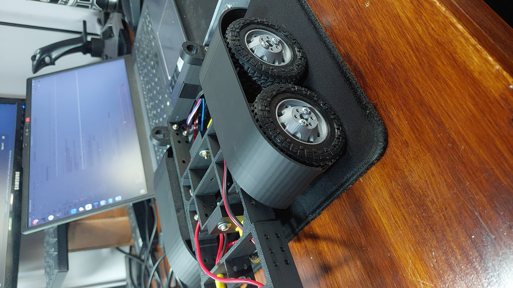

# Guía de armado — RC Truck NeutronLab

Esta guía cubre todo el proceso de construcción del camión RC: desde imprimir las piezas hasta la puesta en marcha. Seguí el orden recomendado para evitar tener que desarmar cosas que ya ensamblaste.

---

## Tabla de contenidos

- [Materiales y herramientas necesarias](#materiales-y-herramientas-necesarias)
- [Paso 1 — Impresión 3D](#paso-1--impresión-3d)
- [Paso 2 — Armado del chasis](#paso-2--armado-del-chasis)
- [Paso 3 — Ejes y ruedas](#paso-3--ejes-y-ruedas)
- [Paso 4 — Sistema de dirección](#paso-4--sistema-de-dirección)
- [Paso 5 — Motor de tracción](#paso-5--motor-de-tracción)
- [Paso 6 — Electrónica y cableado](#paso-6--electrónica-y-cableado)
- [Paso 7 — Tolva volcadora](#paso-7--tolva-volcadora)
- [Paso 8 — Carrocería y detalles](#paso-8--carrocería-y-detalles)
- [Paso 9 — Prueba final](#paso-9--prueba-final)

---

## Materiales y herramientas necesarias

### Herramientas

- Impresora 3D (usé Bambu Lab A1)
- Destornillador Phillips y plano
- Llave allen (set métrico)
- Multímetro digital
- Soldador de estaño + estaño
- Termocontraíble o cinta aisladora
- Pinza de punta fina

### Tornillería y extras

> _(completar con los tornillos exactos que uses: M2, M3, etc., largo y cantidad)_

| Ítem | Cantidad |
|------|----------|
| Tornillos M3 x 10mm | ___ |
| Tornillos M3 x 20mm | ___ |
| Tornillos M2 x 8mm | ___ |
| Tuercas M3 | ___ |
| Varilla roscada (eje tolva) | ___ |
| Cables dupont / silicona | c/n |

---

## Paso 1 — Impresión 3D

Imprimí todas las piezas antes de empezar el armado. Así tenés todo listo y evitás interrupciones.

### Configuración utilizada

| Parámetro | Valor |
|-----------|-------|
| Impresora | Bambu Lab A1 |
| Boquilla | 0.4 mm |
| Altura de capa | 0.2 mm |
| Paredes | 3–4 (ver tabla) |
| Relleno | 20% |
| Material | PLA o PETG |

### Lista de STLs

| Archivo STL | Cantidad | Paredes | Observaciones |
|-------------|----------|---------|---------------|
| `CHASIS_1.stl` | 1 | 4 | Pieza estructural, imprimí con boca abajo si tiene voladizos |
| `CHASIS_2.stl` | 1 | 4 | |
| `CHASIS_3.stl` | 1 | 4 | |
| `EJE.stl` | ___ | 4 | Pieza de carga, máximo relleno recomendado |
| `MASAS.stl` | ___ | 4 | |
| `LLANTA_DEL.stl` | 2 | 3 | |
| `LLANTA_TRA.stl` | 4 | 3 | |
| `NEUMATICO.stl` | 6 | 3 | Imprimir en TPU si es posible, sino PLA flexible |
| `DIRECCION_ARTICULADA.stl` | 1 | 4 | |
| `SUPORT_MOTOR.stl` | 1 | 4 | |
| `CABINA.stl` | 1 | 3 | Pieza estética |
| `RADIADOR.stl` | 1 | 3 | |
| `PARACHOQUES_DEL.stl` | 1 | 3 | |
| `PARACHOQUES_TRA.stl` | 1 | 3 | |
| `GUARDABARROS_TRA.stl` | 2 | 3 | |
| `CAJA_TOLVA.stl` | 1 | 3–4 | |
| `BISAGRA_TOLVA.stl` | ___ | 4 | |
| `PERNO_TOLVA.stl` | ___ | 4 | |

> **Tip:** Las piezas del chasis conviene imprimirlas primero y verificar que encajan antes de imprimir la carrocería.

---

## Paso 2 — Armado del chasis

> 📷 _Foto: chasis armado sin electrónica_

El chasis se divide en 3 partes (`CHASIS_1`, `CHASIS_2`, `CHASIS_3`) que se unen entre sí con tornillos.

**Pasos:**

1. Unir `CHASIS_1` con `CHASIS_2` — alinear los orificios y fijar con tornillos ___(especificar)___.
2. Unir `CHASIS_3` al conjunto anterior.
3. Verificar que el chasis quede rígido y sin flexión lateral.

> _(agregar foto del chasis ensamblado)_

---

## Paso 3 — Ejes y ruedas

> 📷 _Foto: ruedas traseras y eje montados_

**Ensamble de ruedas:**

1. Montar las `MASAS` en el eje.
2. Colocar la `LLANTA_TRA` sobre la masa y fijar con tornillo central.
3. Instalar el `NEUMATICO` sobre la llanta (con un poco de calor si ajusta muy justo en PLA).
4. Repetir para las 4 ruedas traseras y las 2 delanteras (`LLANTA_DEL`).

**Montaje de ejes al chasis:**

1. Insertar el `EJE` en los soportes del chasis.
2. ___(describir cómo queda retenido — tuerca, clip, etc.)___

> _(agregar foto del eje instalado en el chasis)_

---

## Paso 4 — Sistema de dirección

> 📷 _Foto: servo y dirección articulada instalados_

1. Montar la `DIRECCION_ARTICULADA` en el chasis delantero.
2. Insertar el servo SG90/MG90S en su cavidad.
3. Conectar el brazo del servo al mecanismo de dirección.
4. Verificar que el rango de giro no toca topes mecánicos antes de energizar — el código mapea 55° a 135° (centro 95°).

> _(agregar foto del servo instalado)_

---

## Paso 5 — Motor de tracción

> 📷 _Foto: motor DC montado en el soporte_

1. Colocar el motor DC en el `SUPORT_MOTOR`.
2. Fijar el soporte al chasis en la posición ___(especificar)___.
3. Conectar la transmisión al eje trasero ___(describir si hay engranaje, correa, etc.)___.
4. Verificar que el eje gira libre sin fricción excesiva.

> _(agregar foto del motor instalado)_

---

## Paso 6 — Electrónica y cableado

> 📷 _Foto: chasis con toda la electrónica antes de cerrar_

### Componentes a instalar

- ESP32 DevKit V1 (30 pines)
- Driver A4988 + disipador
- Puente H (motor DC)
- LEDs (bajas, freno, reversa, giros)
- Servo SG90/MG90S (ya instalado en paso 4)

### Diagrama de pines

| GPIO | Función |
|------|---------|
| 2 | Servo dirección |
| 4 | DIR (A4988 tolva) |
| 12 | Motor A (adelante) |
| 13 | Motor B (reversa) |
| 14 | Luces bajas |
| 25 | Giro izquierdo |
| 26 | Luz reversa |
| 27 | Luz freno |
| 32 | STEP (A4988 tolva) |
| 33 | Giro derecho |

### Calibración del A4988 (Vref)

> ⚠️ **Hacer esto antes de conectar el NEMA17.**

1. Alimentar el driver (12V en VMOT, 5V en VDD) **sin el motor conectado**.
2. Medir entre el potenciómetro del A4988 y GND.
3. Ajustar hasta obtener entre **0.6V y 0.8V** para un NEMA17 de 1.5A.

> ⚠️ **Nunca enchufar o desenchufar el motor con el driver alimentado.**

### Orden de conexión recomendado

1. ESP32 solo (verificar que el sketch carga y el AP WiFi aparece).
2. Servo + LEDs.
3. Puente H + motor DC.
4. A4988 + NEMA17 (con Vref ya calibrado).

> _(agregar foto del cableado terminado)_

---

## Paso 7 — Tolva volcadora

> 📷 _Foto: tolva armada y bisagra instalada_

1. Armar la `CAJA_TOLVA` — ___(describir si tiene partes que se pegan o atornillan)___.
2. Instalar las `BISAGRA_TOLVA` en la parte trasera del chasis.
3. Apoyar la caja de la tolva sobre las bisagras y fijar con el `PERNO_TOLVA`.
4. Montar el NEMA17 en su soporte — verificar que el mecanismo de elevación mueve la tolva sin trabar.
5. Conectar el NEMA17 al A4988 (identificar bobinas con multímetro en modo continuidad: pares que tienen continuidad entre sí son la misma bobina).

> **Recorrido del motor:** 9000 pasos configurados en el código (límite físico real ~10000).

> _(agregar foto de la tolva levantada con el mecanismo visible)_

---

## Paso 8 — Carrocería y detalles

> 📷 _Foto: carrocería siendo colocada_

1. Colocar el `RADIADOR` en la parte delantera del chasis.
2. Encajar la `CABINA` sobre el chasis — ___(describir cómo fija: tornillos, clips, etc.)___.
3. Montar `PARACHOQUES_DEL` adelante y `PARACHOQUES_TRA` atrás.
4. Colocar los `GUARDABARROS_TRA` sobre las ruedas traseras.
5. Pasar los cables de LEDs delanteros y traseros por dentro de la carrocería.

> _(agregar foto de la carrocería completa antes de cerrar)_

---

## Paso 9 — Prueba final

### Checklist de prueba

- [ ] El ESP32 crea el AP WiFi `Camion-RC-NeutronLab`
- [ ] Desde el celular se accede a `http://192.168.4.1`
- [ ] La interfaz muestra ONLINE
- [ ] El servo responde al volante virtual
- [ ] El motor DC avanza y retrocede
- [ ] Las luces bajas encienden y apagan
- [ ] Los giros parpadean al girar el volante más de 45°
- [ ] La luz de freno enciende al detener el truck (1500 ms)
- [ ] La tolva sube y baja (solo con cardán acoplado + motor detenido)
- [ ] El failsafe corta los motores al desconectar el WiFi

### Vista final

---

> Si tenés dudas o encontraste algo que mejorar, abrí un issue en el repositorio o mandame un mensaje. ¡Que ruede!
